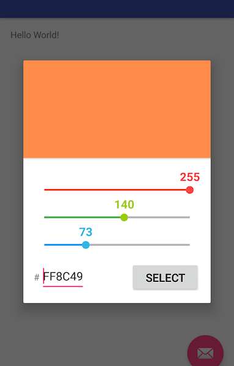
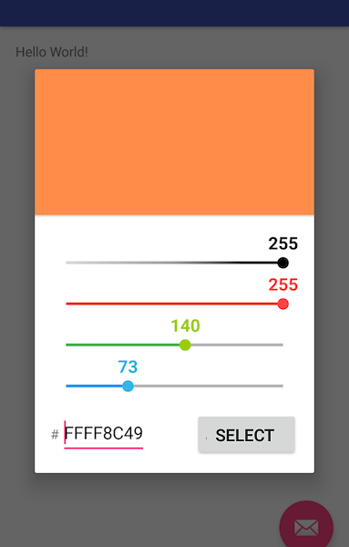
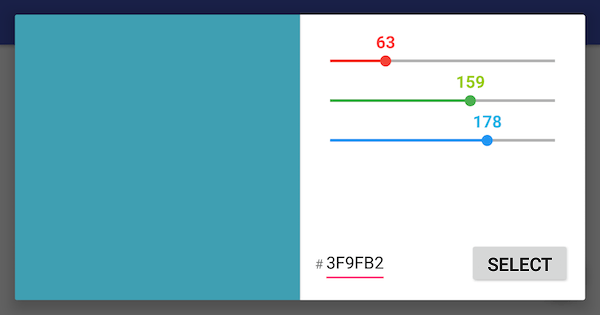

[  ](https://bintray.com/pes8/maven/Material-Color-Picker-Dialog/_latestVersion) [](https://www.paypal.com/cgi-bin/webscr?cmd=_s-xclick&hosted_button_id=DV499BFU9XWFQ)

# Android Material Color Picker Dialog
A simple, minimalistic and beautiful dialog color picker for Android 4.1+ devices. This color picker is easy-to-use and easy-to-integrate in your application to let users of your app choose color in a simple way.

Features
- Get Hex and (A)RGB color codes
- Set color using (A)RGB values and get HEX codes
- Set color using HEX value
- Separate UI for portrait and landscape devices
- Support for pre-lollipop devices

Design inspired from [Dribbble](https://dribbble.com/shots/1858968-Material-Design-colorpicker) by Lucas Bonomi

Portrait




Landscape




## HOW TO USE IT

### Adding the library to your project
The aar artifact is available at the **jcenter** repository. Declare the repository and the
dependency in your `build.gradle`.
    
(root)
```groovy
    repositories {
        jcenter()
    }
```
    
(module)
```groovy    
    dependencies {
        compile 'com.pes.materialcolorpicker:library:1.2.0'
    }
```

### Use the library

Import the class
```java
    import com.pes.androidmaterialcolorpickerdialog.ColorPicker;
```

Create a color picker dialog object

```java
    final ColorPicker cp = new ColorPicker(MainActivity.this, defaultColorR, defaultColorG, defaultColorB);
```

defaultColorR, defaultColorG, defaultColorB are 3 integer (value 0-255) for the initialization of the color picker with your custom color value. If you don't want to start with a color set them to 0 or use only the first argument.

The library also supports alpha values. If no color or only red, green, and blue are specified, the alpha value is set to 255 (0xFF) and no slider is shown.

Use the following constructor to specify an alternative alpha channel value (0..255). As soon as the alpha value constructor is used, a fourth slider will appear above the RGB sliders and the text input field will change from six HEX characters to eight.

```java
    final ColorPicker cp = new ColorPicker(MainActivity.this, defaultAlphaValue, defaultColorR, defaultColorG, defaultColorB);
```


Then show the dialog (when and where you want) and save the selected color

```java
    /* Show color picker dialog */
    cp.show();
    
    /* Set a new Listener called when user click "select" */
    cp.setCallback(new ColorPickerCallback() {
        @Override
        public void onColorChosen(@ColorInt int color) {
            // Do whatever you want
	    // Examples
	    Log.d("Alpha", Integer.toString(Color.alpha(color)));
	    Log.d("Red", Integer.toString(Color.red(color)));
	    Log.d("Green", Integer.toString(Color.green(color)));
	    Log.d("Blue", Integer.toString(Color.blue(color)));

	    Log.d("Pure Hex", Integer.toHexString(color));
	    Log.d("#Hex no alpha", String.format("#%06X", (0xFFFFFF & color)));
	    Log.d("#Hex with alpha", String.format("#%08X", (0xFFFFFFFF & color)));
        }
    });
```

That's all :)

### Transition from v1.1 to v1.2

The deprecated callback has been removed. See *Transition from v1.0 to v1.1*.

### Transition from v1.0 to v1.1

Version 1.1 introduced some API changes---mainly a renaming of the `OnColorSelected` callback interface. This has been renamed to `ColorPickerCallback`.

The old interface is still in the library but will be removed in the next version update. It has been marked as deprecated and isn't called by the library, therefore no values will appear in your app if you still rely on the old interface.
 

## Translations
### Available Languages
* English
* Italian
* German
* French
* Spanish
* Iranian
* Persian

If you would like to help localise this library please fork the project, create and verify your language files, add the language to the README then create a pull request.


## Example

Example app that use Android Material Color Picker Dialog to let users choose the color of the Qr Code:

[Qr Code Generator Play Store](https://play.google.com/store/apps/details?id=com.pes.qrcodegeneratorv2)

[Qr Code Generator Direct Download](http://www.simonepessotto.it/App/QrCodeGeneratorRevolution.apk)

## Donation
If this project help you reduce time to develop, you can give me a cup of coffee :) 

[](https://www.paypal.com/cgi-bin/webscr?cmd=_s-xclick&hosted_button_id=DV499BFU9XWFQ)

## Contributors

Author: [Simone Pessotto](https://www.simonepessotto.it)

### Special thanks to :

[Patrick Geselbracht](https://github.com/PattaFeuFeu)

## LICENSE

```
The MIT License (MIT)

Copyright (c) 2017 Simone Pessotto (http://www.simonepessotto.it)

Permission is hereby granted, free of charge, to any person obtaining a copy
of this software and associated documentation files (the "Software"), to deal
in the Software without restriction, including without limitation the rights
to use, copy, modify, merge, publish, distribute, sublicense, and/or sell
copies of the Software, and to permit persons to whom the Software is
furnished to do so, subject to the following conditions:

The above copyright notice and this permission notice shall be included in all
copies or substantial portions of the Software.

THE SOFTWARE IS PROVIDED "AS IS", WITHOUT WARRANTY OF ANY KIND, EXPRESS OR
IMPLIED, INCLUDING BUT NOT LIMITED TO THE WARRANTIES OF MERCHANTABILITY,
FITNESS FOR A PARTICULAR PURPOSE AND NONINFRINGEMENT. IN NO EVENT SHALL THE
AUTHORS OR COPYRIGHT HOLDERS BE LIABLE FOR ANY CLAIM, DAMAGES OR OTHER
LIABILITY, WHETHER IN AN ACTION OF CONTRACT, TORT OR OTHERWISE, ARISING FROM,
OUT OF OR IN CONNECTION WITH THE SOFTWARE OR THE USE OR OTHER DEALINGS IN THE
SOFTWARE.
```
